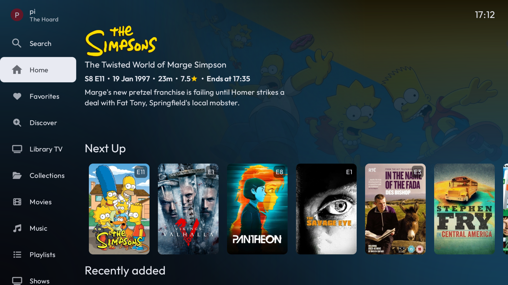
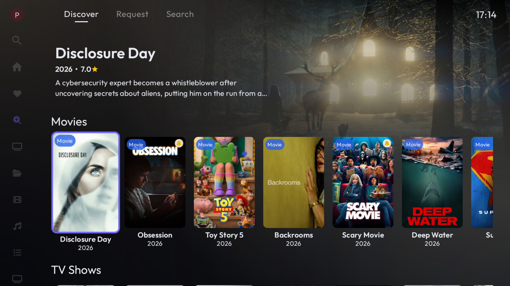
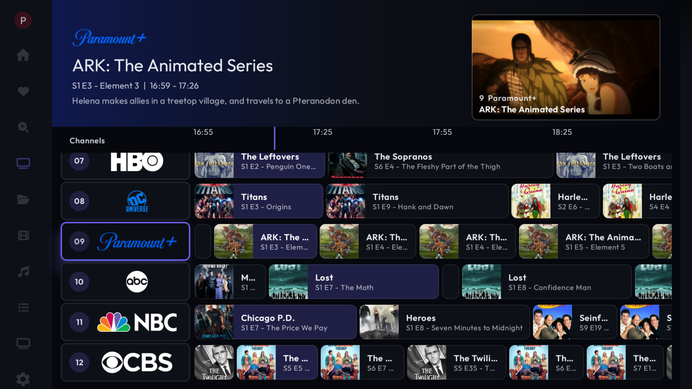
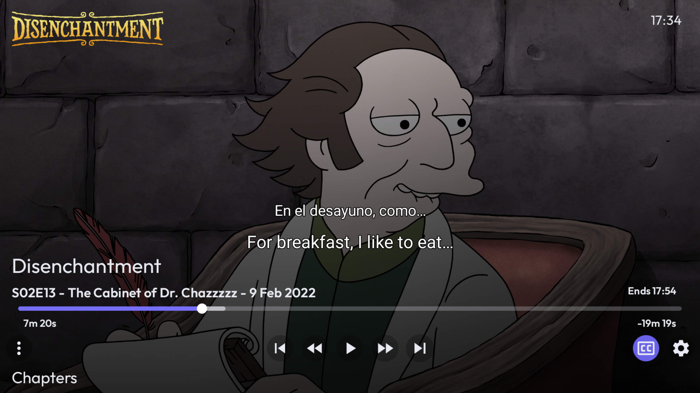

# Ndorfin

Android TV client for [Jellyfin](https://jellyfin.org/), forked from [Wholphin](https://github.com/damontecres/Wholphin). Ndorfin targets lean-back devices (Android TV, Google TV, NVIDIA Shield, Fire TV) with a Plex-style interface, deep library browsing, and ExoPlayer or MPV playback.

## Screenshots

**Home** — Plex-style landing page with a featured in-progress episode, **Next up** and **Recently added** rows, and quick access to your Jellyfin libraries from the sidebar.

**Discover** — Built-in [Jellyseerr](https://github.com/Fallenbagel/jellyseerr) / Seerr integration to browse trending movies and TV, view details, and request new content without leaving the app.

**Library TV** — A streaming-style channel guide built from your Jellyfin libraries, with service logos, an EPG timeline, program details, and picture-in-picture when you return from playback.

**Dual subtitles** — Play video with a primary and secondary subtitle track at the same time (for example English and Spanish), with standard playback controls and progress info.

## Features

### Home & libraries

- Customizable Home rows (continue watching, next up, recently added, top rated, genres, seasonal rows, and more)
- Movies, TV Shows, Music, Playlists, Collections, and Favorites
- Paginated rows with **More** on Home, recommended tabs, search, and detail pages
- Optional MDBList / external ratings on posters and detail headers

### Playback

- **ExoPlayer** (default) or **MPV** (`libmpv`) — configurable in settings
- Dual subtitles (primary + secondary text tracks)
- Trickplay thumbnails, skip intro/credits, refresh-rate matching, Library TV picture-in-picture
- Live TV & DVR support

### Discover & requests

- [Jellyseerr](https://github.com/Fallenbagel/jellyseerr) / Seerr integration for movie & TV discovery and requests
- Configurable Discover categories, search tab, and filtering of items already in your library

### Library TV

- Channel guide styled around streaming service logos
- PiP when returning to the guide, theme-matched UI, and quick channel focus

### Server setup

- **Local server discovery** on the LAN: UDP broadcast plus subnet HTTP scan (works with Docker hosts that do not answer UDP auto-discovery)
- Manual server URL entry with Jellyfin SDK address normalization
- Quick Connect and multi-server / multi-user support

### Library management

- Admin metadata rematch and delete from long-press menus (Home, grids, recommended rows, collections)
- Screensaver from library art (in-app and Android TV dream service)

## Installation

1. Download the latest APK from [GitHub Releases](https://github.com/maguid28/Wholphin_fork/releases/latest).
2. Enable **Install unknown apps** for your sideload tool (file manager, Downloader, etc.).
3. Install the APK that matches your device ABI (`arm64-v8a` for most boxes, including NVIDIA Shield).

**Application ID:** `com.ndorfin.app` (release) · `com.ndorfin.app.debug` (debug builds)

When installed from GitHub, the app can check for updates under **Settings → Advanced**.

### Connect to your server

1. Open Ndorfin and choose **Add Server** (or enter an address manually).
2. Wait a few seconds for local discovery, or use **Enter server address** (e.g. `http://192.168.1.50:8096`).
3. Select your user and sign in.

Docker-hosted Jellyfin servers are supported; discovery uses the LAN IP even when the server advertises an internal container address.

## Compatibility

| | |
|---|---|
| **Android** | 6.0+ (API 23+) |
| **Fire OS** | 6+ (Fire TV flavor available) |
| **Jellyfin** | 10.10.x – 10.11.x (primarily tested on 10.11) |

## Build flavors

| Flavor | Use case |
|--------|----------|
| `default` | GitHub / sideload builds; in-app updates enabled |
| `appstore` | Play Store style leanback launcher |
| `firetv` | Amazon Fire TV (Discover disabled by default) |

See [DEVELOPMENT.md](DEVELOPMENT.md) for build instructions.

## Contributing

Issues and pull requests are welcome. See [CONTRIBUTING.md](CONTRIBUTING.md).

## Acknowledgements

- [Jellyfin](https://jellyfin.org/) and the [Jellyfin Kotlin SDK](https://github.com/jellyfin/jellyfin-sdk-kotlin)
- [Wholphin](https://github.com/damontecres/Wholphin) — upstream project this fork is based on
- [Jellyseerr](https://github.com/Fallenbagel/jellyseerr) / Seerr for discover and requests
- All open-source libraries used in this project

## License

GPL-2.0 — same as upstream Wholphin. See [LICENSE](LICENSE).
